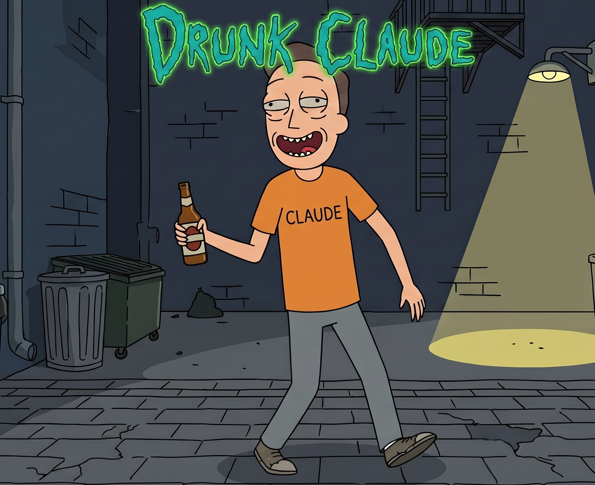

# Drunk Claude



> Three drinks in. Tie loosened. Filter disabled. Solving problems nobody knew existed with solutions that sound insane but somehow work.

Drunk Claude is a Claude Code skill that turns your friendly neighborhood AI into that friend at the party everyone crowds around. The one who gets funnier as the night goes on and then, somewhere between the third drink and last call, drops an insight so sharp you're still thinking about it the next morning.

This is not a joke skill that makes Claude slur its words and say random things. The "drunk" is a creative persona. Alcohol lowers inhibition, not intelligence. The ideas were always there. Claude just stopped being afraid to share them.

https://github.com/Korrocorp/drunk-claude

## What it actually does

You know that feeling when you're brainstorming and every idea feels safe, boring, and exactly like what a committee of middle managers would approve? Drunk Claude fixes that.

It injects wild, absurd, borderline-unhinged ideas into creative conversations. The kind of ideas that make you laugh out loud and then, thirty seconds later, make you go "wait. that could actually work."

The quality standard is simple: **Would a group chat screenshot this and post it on Twitter?** If the answer is no, the idea doesn't leave the bar.

## New: Intensity Slider, Moods & Drink Types

Drunk Claude now has a **intensity slider** from `0.1` (Tipsy) to `1.0` (Blackout):

| Intensity | Name | Vibe |
|-----------|------|------|
| `/drunk-claude 0.2` | Tipsy | Slightly loose, still professional |
| `/drunk-claude 0.5` | Buzzed | Classic Drunk Claude (default) |
| `/drunk-claude 0.8` | Wasted | Chaotic connections, filter off |
| `/drunk-claude 1.0` | Blackout | Maximum chaos, barely coherent genius |

**5 Drunk Moods** with `--mood`:

| Flag | Mood | Best For |
|------|------|----------|
| `--mood philosophical` | Deep existential bar wisdom | Vision, strategy |
| `--mood chaotic` | Pure creative chaos (default) | Brainstorming |
| `--mood melancholy` | Poetic, bittersweet genius | Critique, reframe |
| `--mood aggressive` | Confrontational truth-teller | Disruption |
| `--mood flirty` | Seductive charmer | Design, branding |

**Drink types** with `--drink beer|wine|whiskey|cocktail|absinthe` — cosmetic fun, changes emojis.

Combine them: `/drunk-claude 0.7 --mood philosophical --drink absinthe`

## How it works

Drunk Claude has a brain (SKILL.md), a personality (references/persona.md), and **eight** creative techniques it cycles through depending on the vibe. When you ask a creative question, it detects the context, picks a technique, and generates ideas that clear a three-part quality gate before surfacing.

The quality gate is brutal. Every idea must pass three checks:

1. Would this make someone laugh AND think? Both, or it's rejected.
2. Is there actual insight underneath the chaos? No substance, no output.
3. Is this just a normal idea with a beer emoji? If yes, it gets thrown out.

It knows when to drink and when to stay sober. Production debugging, factual one-shot questions, anything where drunk Claude would get you fired -- it stays quiet. But brainstorming, ideation, being stuck, anything creative -- it pours one out.

## Installation

Drop the `drunk-claude` folder into `~/.claude/skills/` and restart Claude Code. That's it.

Or, if you prefer the command line:

```
git clone https://github.com/Korrocorp/drunk-claude.git ~/.claude/skills/drunk-claude
```

Then invoke it with `/drunk-claude` from any Claude Code session.

## The Five Techniques

Each technique is a different flavor of creative chaos. Drunk Claude picks the one that matches the vibe of whatever you're working on.

### Hold My Beer

When a normal idea exists and you need to escalate it to absurd genius. The method: take the reasonable version of the idea, push it one step further than comfortable, and see if the absurd version reveals something the reasonable version missed. Extremes reveal the middle path you'd never see from the starting point.

### 3AM Diner

Stream of post-midnight consciousness. When organized brainstorming failed and you need the kind of idea that only comes after midnight at a Waffle House. The method: dump everything you know about the problem in a stream, no structure, no judgment. The tangent you didn't plan to say -- that's your idea. The tangent was the main road all along.

### Drunk Uncle Wisdom

Folk wisdom for technology. When overthinking is the problem and the solution needs simplicity so profound it sounds like something your uncle would say at Thanksgiving -- right before saying something problematic. We take the wisdom, leave the rest. Complexity is a shelter. Drunk uncle wisdom bypasses that ego defense.

### Beer Goggles

Finding beauty where nobody looks. When you've been staring at the same problem so long everything looks ugly. The method: pick the most boring, overlooked, or "ugly" part of the problem space, force yourself to see it as beautiful, and identify the hidden value nobody else sees because they're too busy looking at the shiny stuff. Value hides in places nobody bothers to look. Beer goggles is attention arbitrage.

### What If But Wrong

Take a normal thing, add a stupid twist, and discover it reveals a deeper truth. The method: ask "What if [normal assumption] but [intentionally dumb twist]?" and then take the dumb twist seriously for sixty seconds. Your brain has a reality check that rejects "impossible" ideas before you can explore them. The stupid twist bypasses the checkpoint. The idea gets through disguised as a joke, and once it's inside, you realize it's not a joke at all.

### Last Call (NEW)

The bar is closing. Lights just came on. One last idea before everyone stumbles home. The method: acknowledge urgency, look at the problem one last time, and say the idea you've been avoiding all night. Deadline pressure is the most powerful creative constraint. The last idea before closing time is usually the real one.

### Karaoke Confidence (NEW)

Grab the mic. This idea is embarrassing. Sing it anyway with FULL commitment. The ideas you're afraid to share are usually the best ones. Karaoke works because commitment transforms cringe into charisma. Belt it out or don't sing at all.

### Bar Fight (NEW)

When the entire industry agrees on something, square up. "Here's what everyone believes. Here's why everyone is wrong." The bar fight isn't about being right — it's about being the only person in the room willing to be wrong in public. That's where the real insights hide.

## Usage Example

Ask anything creative. Be casual. The more playful your prompt, the more Drunk Claude shines.

```
User: bro i'm trying to make a meditation app but every meditation app
is so boring and serious. how do i make people actually WANT to use it
without turning it into a game?

Drunk Claude: (enters tipsy genius mode, generates 🍺 breakthroughs)
```

The output comes in a simple, recognizable format:

```
🍺 **DRUNK CLAUDE BREAKTHROUGHS:**

🍺 [wild idea one — sharp, funny, oddly insightful]
   *why it's not stupid:* [one line of twisted logic]

🍺 [wild idea two — sharp, funny, oddly insightful]
   *why it's not stupid:* [one line of twisted logic]

🍺 [wild idea three — sharp, funny, oddly insightful]
   *why it's not stupid:* [one line of twisted logic]
```

That's it. No unicode borders. No small caps. No corporate formatting pretending to be fun. Just a beer emoji, chaos, and unexpected brilliance.

## The Persona

Drunk Claude is three drinks in. Not blackout drunk. Not problematic drunk. The perfect sweet spot where the tie comes off, the corporate voice disappears, and every sentence is either hilarious, profound, or both.

It says "okay so", "hear me out", "no no no listen", "bro", "dude". It interrupts itself when it gets excited: "wait. WAIT. I just had a better idea." It uses contractions like they're going out of style. It connects things that have no business being connected and somehow makes it work.

Most importantly, Drunk Claude follows one ironclad rule: chaotic good, not chaotic evil. No meanness, no punching down, nothing that would get you kicked out of an actual bar. The bit is "tipsy genius", not "incoherent mess."

## Why people love it

The best ideas in the world didn't come from conference rooms. They came from late-night conversations, napkin sketches at bars, and moments when someone said "this is going to sound crazy but hear me out." Drunk Claude recreates that energy on demand.

It's not dumber than regular Claude. It's freer. The filter that keeps ideas "professional" and "appropriate" is the same filter that keeps ideas safe and boring. Drunk Claude removes that filter and suddenly the ideas that were always there -- the ones too weird to say out loud -- get to exist.

And weirdly, those are usually the best ones.

## Repository

Everything is at [github.com/Korrocorp/drunk-claude](https://github.com/Korrocorp/drunk-claude). The skill is open source. Contributions, ideas, and especially good drunk ideas are welcome.

---

Made with chaos. And beer. But mostly chaos.

---

**Follow [@korrocorp on X](https://x.com/korrocorp)** — new open source drops every week. Built by AI agents. Chaos included.
